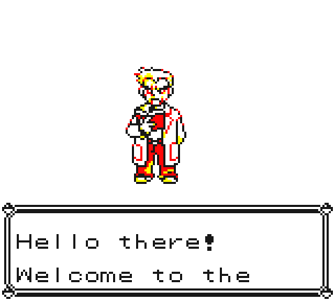
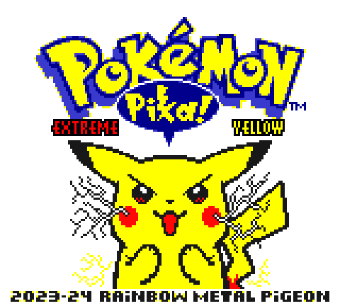
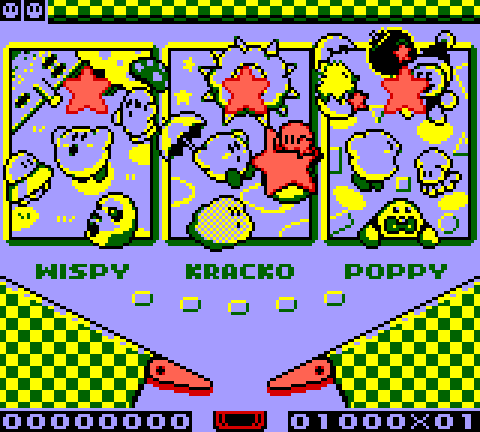

# dmwss

**D**ot **M**atrix **W**ith **S**tereo **S**ound — a Game Boy and Game Boy Color emulator written in modern C++20, with a Qt6 desktop frontend, a WebAssembly browser build, and an Android port.

[](https://github.com/JMit-dev/dmwss/actions/workflows/build.yml)
[](https://github.com/JMit-dev/dmwss/actions/workflows/pages.yml)

**[▶ Play in your browser](https://jmit-dev.github.io/dmwss/)** — no install, no download.

Prefer a native app? Grab a build from **[Releases](https://github.com/JMit-dev/dmwss/releases)**: an AppImage for Linux, a zip for Windows, a zip for macOS, and an APK for Android. Each is self-contained — unzip (or `chmod +x` the AppImage, or install the APK) and run, no separate Qt install needed.

> The Android build is the newest part of the pipeline and doesn't have the same track record as the other four yet — if a given release is missing the APK, that release's Android build failed in CI (it's allowed to, without blocking the rest) and the next release should have it.

| | | |
|---|---|---|
|  |  |  |
| Pokemon Yellow (CGB) | Extreme Yellow (GBC hack) | Kirby's Pinball Land (MBC2) |

## Features

**Emulation core**
- Full LR35902 CPU: all documented opcodes and the CB-prefixed instruction set, with correct interrupt handling, the HALT bug, and CGB double-speed mode
- PPU with mode-accurate timing, background/window/sprite rendering, and the DMG OAM corruption bug
- APU with all four channels through a `miniaudio` backend
- Software fastmem (page-table-backed memory access) and an event-driven scheduler for cycle-accurate timing
- Memory Bank Controllers: **MBC0, MBC1, MBC2, MBC3 (with a real-time, wall-clock-driven RTC), MBC5, and HuC1**
- Verified against blargg's test ROM suite: `cpu_instrs`, `instr_timing`, `mem_timing`, `mem_timing-2`, `halt_bug`, `interrupt_time`, `oam_bug`, and the full `dmg_sound` audio suite — 41/41 passing in CI

**Game Boy Color**
- Banked VRAM (2 banks) and WRAM (8 banks) with correct `VBK`/`SVBK` handling
- Color palette RAM (`BCPS`/`BCPD`/`OCPS`/`OCPD`), BG tile attributes, and per-object CGB palettes
- HDMA/GDMA (general-purpose and HBlank-timed VRAM DMA)
- Automatic **boot-ROM colorization** for original DMG games — the same title-checksum-based palette assignment algorithm the real CGB boot ROM uses, so classic Game Boy games get their authentic GBC color palette by default
- Optional real boot ROM support (drop a `dmg_boot.bin`/`cgb_boot.bin` next to the executable for the authentic startup logo)

**Quality of life**
- 9 save state slots (quick save/load plus a full slot menu)
- GameShark and Game Genie cheat code support, saved per-game
- Rebindable controls (desktop build)
- 4 selectable DMG display palettes (or the GBC colorization) and 3 scaling modes
- Link cable emulation over TCP, so two instances (on the same machine or over a network) can trade/connect

**Android**
- Multitouch on-screen D-pad and buttons, tracked as independent touch points so diagonals and holding a direction plus a face button both work correctly
- ROMs picked through Android's file picker are copied into app-private storage on load, so save files, save states, and cheats all work the same as on desktop
- Landscape-only for now (the touch layout doesn't have a portrait variant yet)

## Controls

Default keyboard bindings — rebindable on desktop via **Tools → Controls…**; fixed on the web build; on Android, use the on-screen D-pad and buttons instead:

| Game Boy | Key |
|---|---|
| D-Pad | Arrow keys |
| A | <kbd>Z</kbd> |
| B | <kbd>X</kbd> |
| Select | <kbd>Space</kbd> |
| Start | <kbd>Enter</kbd> |

## Building from source

### Prerequisites

```bash
# Linux (Debian/Ubuntu)
sudo apt-get install qt6-base-dev libgl1-mesa-dev cmake build-essential

# macOS
brew install qt@6 cmake

# Windows
# Install Qt6 (https://www.qt.io/download) and Visual Studio 2022 with the C++ workload
```

### Build

```bash
git clone --recursive https://github.com/JMit-dev/dmwss.git
cd dmwss

cmake -B build -DCMAKE_BUILD_TYPE=Release
cmake --build build --config Release

./build/dmwss   # Windows: build\Release\dmwss.exe
```

By default the build is tuned for the host CPU (`-march=native`/`/arch:AVX2`). For a binary you intend to distribute to other machines, disable that:

```bash
cmake -B build -DCMAKE_BUILD_TYPE=Release -DDMWSS_NATIVE=OFF
```

### Web build

Requires [Emscripten](https://emscripten.org/):

```bash
sh web/build.sh          # output in web/dist/
```

`web/dist/` needs to be served over HTTP (not opened as a `file://` URL — the browser's WASM loader requires it). The live version at the top of this README is deployed automatically from `master`.

### Android

Requires a Qt6 install for Android (`android_arm64_v8a`) *and* a matching host Qt6 install (Qt's cross-compiled CMake tooling still needs a native `moc`/`rcc`/`uic`), plus the Android NDK. See `.github/workflows/release.yml`'s `build-android` job for the exact versions and flags this project builds against:

```bash
cmake -B build-android -S . \
  -DCMAKE_TOOLCHAIN_FILE=$NDK_ROOT/build/cmake/android.toolchain.cmake \
  -DANDROID_ABI=arm64-v8a \
  -DANDROID_PLATFORM=android-28 \
  -DQT_HOST_PATH=/path/to/host/Qt/6.8.2/gcc_64 \
  -DCMAKE_PREFIX_PATH=/path/to/android/Qt/6.8.2/android_arm64_v8a \
  -DCMAKE_BUILD_TYPE=Release -DDMWSS_NATIVE=OFF

cmake --build build-android --target dmwss_make_apk
```

The APK lands somewhere under `build-android/android-build/`.

### Tests

```bash
cmake --build build --target blargg_runner
ctest --test-dir build --output-on-failure
```

The test suite needs blargg's test ROMs, which aren't included in this repository (see [Legal](#legal)):

```bash
git clone https://github.com/retrio/gb-test-roms.git test-roms/gb-test-roms
```

## Architecture

```
src/
├── core/       Platform-agnostic emulation: CPU, PPU, APU, MBCs, memory, scheduler, timer, serial
├── machine/    System integration: GameBoy class, cartridge/save-state handling, cheats
├── ui/         Qt6 desktop frontend: main window, OpenGL display, dialogs, audio/link-cable backends
└── main.cpp
web/            Emscripten build: C ABI wrapper over the core + browser frontend
shaders/        Display shaders
```

`src/core` and `src/machine` have no Qt dependency — they build standalone as `dmwss_core`, which is what both the desktop frontend and the web build link against.

## Third-party libraries

Qt6, [fmt](https://github.com/fmtlib/fmt), [spdlog](https://github.com/gabime/spdlog), [miniaudio](https://github.com/mackron/miniaudio), and [nlohmann/json](https://github.com/nlohmann/json), vendored as git submodules or found via the system package manager.

## Legal

This project contains no Nintendo code, ROMs, or boot ROM images. Cartridge ROMs, boot ROM dumps, and test ROMs are not distributed here and must be supplied by the user from their own legally obtained copies. "Game Boy" and "Game Boy Color" are trademarks of Nintendo.

## License

GPLv3
